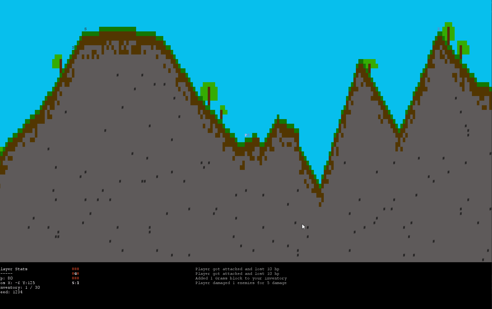
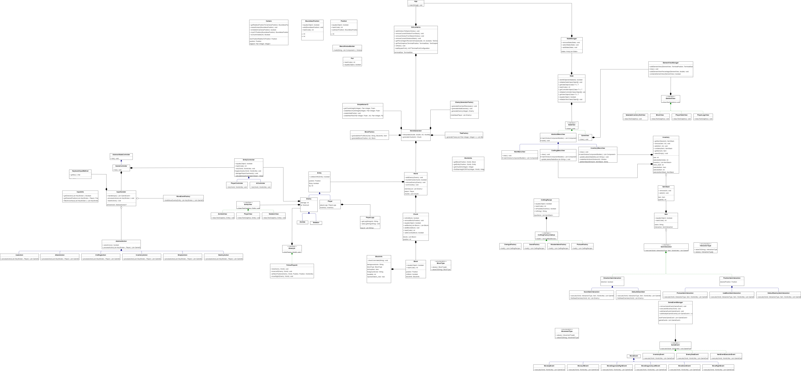
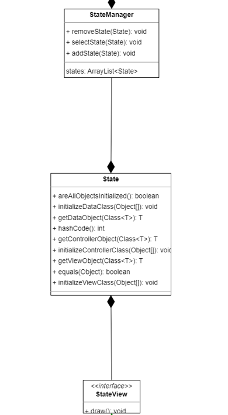
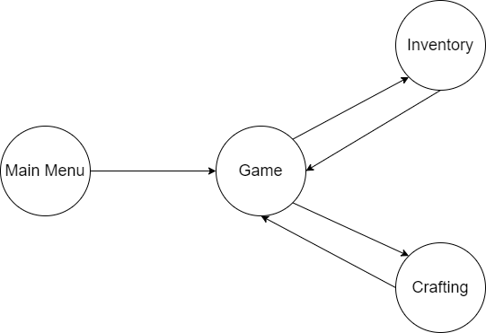
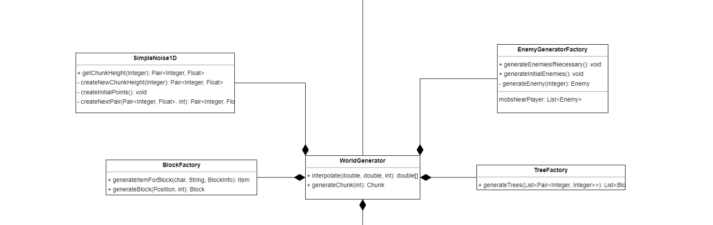
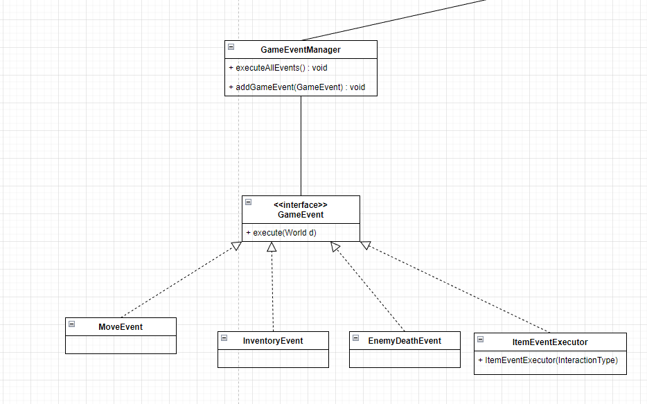
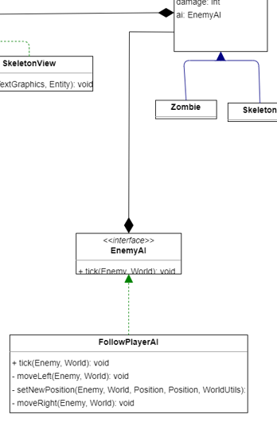
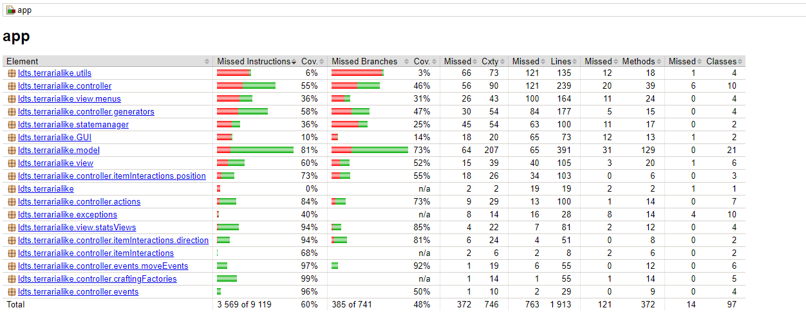
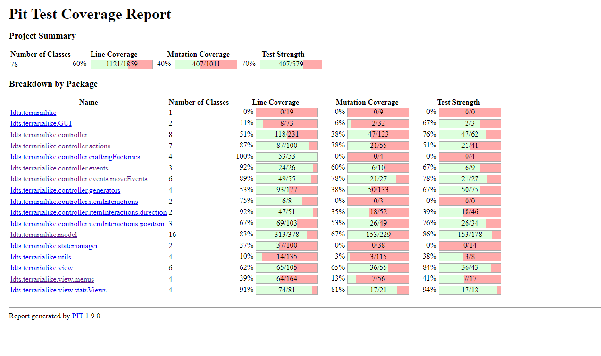

# LDTS - TerrariaLike

In this exciting 2D sandbox game, you can do anything! Build houses, mine ores and even kill monsters. The world is randomly-generated providing unique experiences every time!

This project was developed by Luís Duarte (up202108734@fe.up.pt), Tomás Ramos (up202108687@fe.up.pt) and António Romão (up202108704@fe.up.pt)

## IMPLEMENTED FEATURES

 - Random World Generation
 - Player Inventory
 - Mining
 - Crafting
 - Various mobs such as (Zombies, Skeletons)
 - Building
 - Various items that improve mining, building and damage (such as swords and pickaxes)
 - Main menu (to change settings such as World Seed)
 

 
 Note: World seed is 1234.

## DESIGN

### ARCHITECTURAL PATTERN

In this project we use **MVC** (Model View Controller) and this methodology consists of:
-  **Model**: Holds **only** data important to the game and it's rules and it's independent from the interface.

- **View**: It's job it's to take the data from the **Model** and visualize it for the end-user.
 
- **Controller**: The **Controller** is supposed to listen to events or changes triggred by the **View** or by itself and it's the only section that should mutate the **Model** data accordingly.

This methodology allows us to section the game into three main parts, but where almost all logic is centered in the **Controller** part, this makes the project overall much more maintainable (we can easily deduce easily where, for example, a bug in the code is).

This is important because Terraria (even a simple version like this one), is a game with a lot of interactions and we can very easily get lost with everything and the code becoming loosely tight and almost unreadable.

### **UML**

Note: probably you should open the UML in another tab because it's big

### **States**

 **Problem in Context**: 
 
 At the heart of the game, we need a way to change "Scenes" (example: from the Crafting Menu to the Game itself) without losing data on
one of the states. This becomes essential, because for a game to be playable and somewhat enjoyable, we need to keep game progress in some way while also keeping the code somewhat organized and readable when changing states.

 **The pattern**:
 
  So it was decided that we would use the **State** pattern to solve this problem, which keeps the current state and makes changes to the behaviour easier considering that we keep those in another Class (this is the main difference to a textbook **State** pattern implementation, it is better to abstract the keeping the older **State** in memory than passing the model around many **States** to keep game memory).

 **Implementation**:

Implemented Files:
 - [State.java](https://github.com/FEUP-LDTS-2022/project-l05gr02/blob/45bc9ef00f6d7afcc06720c80a84ea583fb5d0a3/app/src/main/java/ldts/terrarialike/statemanager/State.java)
 - [StateManager.java](https://github.com/FEUP-LDTS-2022/project-l05gr02/blob/45bc9ef00f6d7afcc06720c80a84ea583fb5d0a3/app/src/main/java/ldts/terrarialike/statemanager/StateManager.java)

**Consequences**: 

The implementation of the pattern is not easy because we need a way to keep various states in the same list, so we had to use reflection in State.java (which is kind of a code smell as we will get to later). Because we keep the memory of old states, we need to be careful when we need to reset them which add a bit more complexity

There are 4 states in the game as described in the image below:

### **Entities**

**Problem in Context**: 

Terraria has a lot of types of Entities such as: Animals, flying Enemies, normal Enemies, NPCs (which can help and trade with the player) and, of course, the Player.

Even though, we don't implement all features from Terraria, this can still hinder our ability to make all interactions between these and the World a very difficult task to implement. So in order to solve this, is needed a baseplate that **all** moving object have to use.

**The pattern**

We use the **Prototype** pattern to resolve this exact of problem and allows for a lot of flexibility when adding new types of Entities. A **Prototype** alows us to create/use objects without making the code completly dependent on their specific classes.

- **Implementation**:

Implemented files:

- [Entity.java](https://github.com/FEUP-LDTS-2022/project-l05gr02/blob/45bc9ef00f6d7afcc06720c80a84ea583fb5d0a3/app/src/main/java/ldts/terrarialike/model/Entity.java)

- [Player.java](https://github.com/FEUP-LDTS-2022/project-l05gr02/blob/45bc9ef00f6d7afcc06720c80a84ea583fb5d0a3/app/src/main/java/ldts/terrarialike/model/Player.java)

- [Enemy.java](https://github.com/FEUP-LDTS-2022/project-l05gr02/blob/45bc9ef00f6d7afcc06720c80a84ea583fb5d0a3/app/src/main/java/ldts/terrarialike/model/Enemy.java)

- [Zombie.java](https://github.com/FEUP-LDTS-2022/project-l05gr02/blob/45bc9ef00f6d7afcc06720c80a84ea583fb5d0a3/app/src/main/java/ldts/terrarialike/model/Zombie.java)

- [Skeleton.java](https://github.com/FEUP-LDTS-2022/project-l05gr02/blob/45bc9ef00f6d7afcc06720c80a84ea583fb5d0a3/app/src/main/java/ldts/terrarialike/model/Skeleton.java)

    

**Consequences**:

We can keep the code more organized and avoid a lot of code duplication with this method.

### **Enemy generation and random World generation**

 **Problem in Context**: 

We can have a lot of types of enemies and even a lot of types of blocks, which is a big problem when we think about implementing this in a clever and maintainable way, so we need a way to abstract the complex the creation of blocks and enemies in a single class.

**The pattern**: 

We use the **Factory** pattern to abstract the enemy creation. The **Factory** pattern helps us to create new types of Enemies  without the user knowing how to actually create them.

- **Implementation**

Implemented Files:
- [WorldGenerator.java](https://github.com/FEUP-LDTS-2022/project-l05gr02/blob/45bc9ef00f6d7afcc06720c80a84ea583fb5d0a3/app/src/main/java/ldts/terrarialike/controller/generators/WorldGenerator.java)
- [TreeFactory.java](https://github.com/FEUP-LDTS-2022/project-l05gr02/blob/45bc9ef00f6d7afcc06720c80a84ea583fb5d0a3/app/src/main/java/ldts/terrarialike/controller/generators/TreeFactory.java)
- [BlockFactory.java](https://github.com/FEUP-LDTS-2022/project-l05gr02/blob/45bc9ef00f6d7afcc06720c80a84ea583fb5d0a3/app/src/main/java/ldts/terrarialike/controller/generators/BlockFactory.java)
- [EnemyGeneratorFactory.java](https://github.com/FEUP-LDTS-2022/project-l05gr02/blob/45bc9ef00f6d7afcc06720c80a84ea583fb5d0a3/app/src/main/java/ldts/terrarialike/controller/generators/EnemyGeneratorFactory.java)

**Consequences**: 

The code stays more maintainable, readable and more efficient because we keep the creation part of Blocks/Enemies on seperate isolated classes.

### **Events**

**Problem in Context**: 

We have a lot of interactions in Terraria, as said a lot of times, but there are some interactions that are more short-lived than others. Like movements, item interactions or a enemy dying. So we need to create a short-lived **Controller**, we call this a **GameEvent**, to make the **GameEvent** we need a common base to avoid complexity when it will be executed.

 **The pattern**:
 
  We use the **Command** pattern to make all the GameEvents implement the execute() method and can be called without code reuse. This makes every **GameEvent** implement the same function and we can generalize all **GameEvents** to a simple manager that executes them all.

**Implementation**:

Implemented files:

- [GameEventManager](https://github.com/FEUP-LDTS-2022/project-l05gr02/blob/45bc9ef00f6d7afcc06720c80a84ea583fb5d0a3/app/src/main/java/ldts/terrarialike/controller/GameEventManager.java)
- [All game events](https://github.com/FEUP-LDTS-2022/project-l05gr02/tree/main/app/src/main/java/ldts/terrarialike/controller/events)

**Consequences**:

This pattern makes way easier to create a new short-lived interaction in the Game.

### **Enemy AI**
**Problem in Context**: 

We need a way to abstract the AI algorithm from the concrete Enemy, because this can lead to way to much code duplication. For example, let's say we have a Zombie and a Skeleton, that can use 3 AI algorithms, to implement all combinations we need to implement 6 classes which doesn't scale very well, with additions to the Enemies or AI algorithms.

**The pattern** 

We use the **Bridge** pattern to abstract away the EnemyAI algorithm from the enemy.

**Implementation**

**Consequences**

This makes the code more easy to implement different types of AI on the same enemy.

### **Other classes**

All other classes are very similar to this problems so far so it's better to checkout the UML above to see how we've implemented the rest of the project. 

The most common Pattern is the **Command** Pattern, used in AbstractAction and .

### **Known code smels and refactoring suggestions**

- We use reflection to implement the states, this is usually not recommended and probably not needed. But it's more simple to implement in this way and makes for generally more cleaner code than hopping the old state in the new states constructor, so it was a necessary solution.

- The seperation of InputHandler/InputUtils and World/WorldUtils is considered in my opinion a code smell, even though, it was needed to solve another code smell (because InputUtils and World was almost unmaintainable and too long). This seperation causes more arguments in constructors/methods that use it but we prefer it that way.

- The menuViews violates the MVC pattern because, the GUI2 Lanterna implmentation uses Components, these components might require, on creation, a function that is called when the user presses it and therefore we need to embed the functions that can mutate the World in the View. This makes code a little more complicated to understand, but a needed one for the simplicity of GUI2 menus.

- The crafting recipes are stored on a static factory class which is not very scalable and makes the recipes static, that require recomplication to change them. A better solution should be serialization of craftingRecipes to a .json file, for example. This solution is a bit complicated to scale (probably will add a bit of reflection) and a bit out of scope for a "simple" project like this that doesn't have that many interactions.

### TESTING

### SELF-EVALUATION

- Luís Duarte -> 45%
- Tomás Ramos -> 45%
- António Romão -> 10%

Note: Some commits between Luís and Tomás are made using Code With Me so there's a discrepancy on commit numbers.