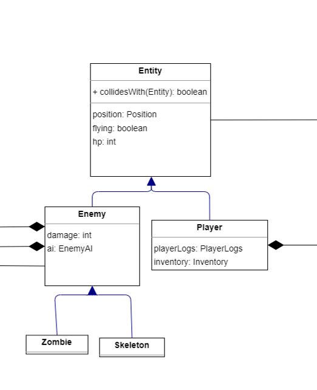
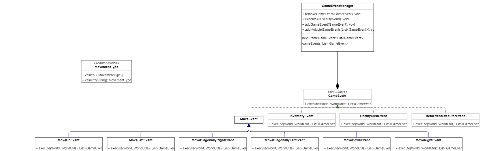

# LDTS - TerrariaLike

In this exciting 2D sandbox game, you can do anything! Build houses, mine ores and even kill monsters. The world is randomly-generated providing unique experiences every time!

This project was developed by Luís Duarte (up202108734@fe.up.pt), Tomás Ramos (up202108687@fe.up.pt) and António Romão (up202108704@fe.up.pt)

## IMPLEMENTED FEATURES

## PLANNED FEATURES

 - Random World Generation
 - Player Inventory
 - Mining
 - Crafting
 - Various mobs such as (Zombies, Skeletons)
 - Building
 - Various items that improve mining, building and damage (such as swords, pickaxes, axes etc...)
 - Chests (in order to keep items)
 - Main menu (to change settings such as World Seed or keybindings)
 - 

 

## DESIGN

### ARCHITECTURAL PATTERN

In this project we use **MVC** (Model View Controller) and this methodology consists of:
-  **Model**: Holds the data important to the game and it's rules and it's independent from the interface.

- **View**: It's job it's to take the data from the **Model** and visualize it.

- **Controller**: The **Controller** is supposed to listen to Events triggred by the **View** or by itself and mutates the **Model** data accordingly.

This brings many advantages such as code reuse and parallel development.

- **Problem in Context.** The description of the design context and the concrete problem that motivated the instantiation of the pattern. Someone else other than the original developer should be able to read and understand all the motivations for the decisions made. When refering to the implementation before the pattern was applied, don’t forget to [link to the relevant lines of code](https://help.github.com/en/articles/creating-a-permanent-link-to-a-code-snippet) in the appropriate version.
- **The Pattern.** Identify the design pattern to be applied, why it was selected and how it is a good fit considering the existing design context and the problem at hand.
- **Implementation.** Show how the pattern roles, operations and associations were mapped to the concrete design classes. Illustrate it with a UML class diagram, and refer to the corresponding source code with links to the relevant lines (these should be [relative links](https://help.github.com/en/articles/about-readmes#relative-links-and-image-paths-in-readme-files). When doing this, always point to the latest version of the code.
- **Consequences.** Benefits and liabilities of the design after the pattern instantiation, eventually comparing these consequences with those of alternative solutions.

### States

- **Problem in Context**: At the heart of the game we needed a way to change "Scenes" (example: from the Pause Menu to the Game) without losing data on
one of the states. 

- **The pattern**: We used the **State** pattern to do this, which keeps the  current state and makes changes to the behaviour easier considering that we keep those in another Class.

- **Implementation**:

- **Consequences**: Because we keep all State's memory, we must be careful when we want to reset a State because it will be initialized before.

### Entites

- **Problem in Context**: It's essencial that we keep the entities organized and because we can have a lot of types of Entites (such as Player and Enemies) and a lot of common data shared between the two.
- **The pattern**: We use the **Prototype** pattern to resolve this exact of problem and allows for a lot of flexibility when adding new types of Entities.

- **Implementation**:

- **Consequences**: We can keep the code more organized and avoid a lot of code duplication with this method.

### A lot of enemies

- **Problem in Context**: Because we can have a lot of enemies it can be hard to generate them all, in a organized way.

- **The pattern**: We use the **Factory** pattern to abstract the enemy creation

- **Implementation**

### Events

- **Problem in Context**: We can have a lot of interactions that will be implemented in the game, and we need to way to generalize the GameEvent

- **The pattern**: We use the **Command** pattern to make all the GameEvents implement the execute() method and can be called without a lot of code reuse

- **Implementation**:

### Enemy AI
- **Problem in Context**: We need a way to abstract the AI algorithm from the concrete Enemy, because this can lead to way to much code duplication. For example, let's say we have a Zombie and a Skeleton, that can use 3 AI algorithms, to implement all combinations we need to implment 6 classes which doesn't scale very well, with additions to the Enemies or AI algorithms

- **The pattern**: We use the **Bridge** pattern to abstract away the EnemyAI algorithm from the enemy.

- **Implementation**:

### TESTING

- Screenshot of coverage report.
- Link to mutation testing report.

